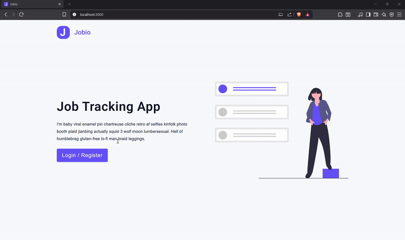

# React.js Jobs Dashboard App

This is a fork of [John Smilga's job app](https://github.com/john-smilga/react-jobs-app/), modified to work with my custom backend APIs built in [ts-express-jobs-api](https://github.com/AdhamElRouby/ts-express-jobs-api/). The app functions as a job management system, allowing users to log in, create job entries, update existing ones, and delete them.


<div align="center">



</div>

## Run Locally

Clone the project

```bash
  git clone https://github.com/AdhamElRouby/react-jobs-app.git
```

Go to the project directory

```bash
  cd .\react-jobs-app
```

Open with VSCode

```bash
  code .
```

Install dependencies

```bash
  npm install
```

Open with live server

```bash
  npm start
```
The web app will be running live at `http://localhost:3000`.

## Contributing

I welcome contributions to this project! Feel free to submit pull requests and suggest improvements. 
If you have any questions or need assistance, don’t hesitate to contact me at adhamelrouby@aucegypt.edu.
